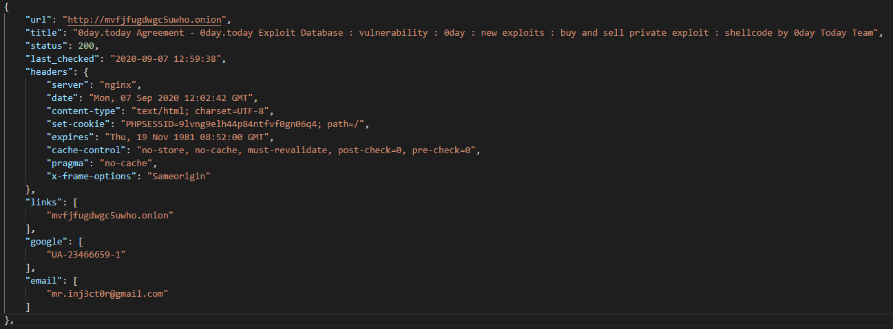
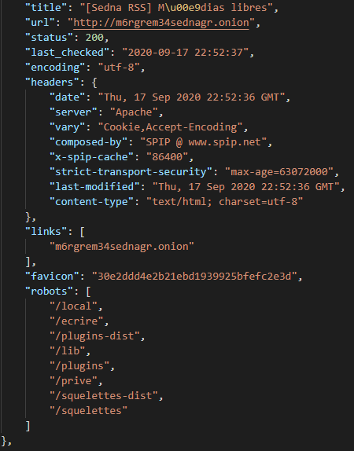

#### Introduction

Back in 2015 (before the dark web was "trendy") I started writing code to scan the dark web (specifically Tor). It was based off a conversation with Daniel Cuthbert ([@danielcuthbert](https://twitter.com/dcuthbert)) about whether you could use the same techniques for mapping infrastructure on the surface web (the normal web bit) on dark web servers.

Over the years the number of companies selling "Dark Web" data as part of their platform has grown, but it doesn't have to be expensive or complicated to build your own "Dark Web Threat Intel" platform.

**DISCLAIMER: You will find some websites on Tor that contain illicit/illegal material, be sensible about what you view and be willing to accept the risk/liability if you do something stupid**

We have 4 objectives that we want to achieve.

1. Validate a list of dark web servers
2. Build your Tor infrastructure (proxies, load balancers)
3. Run your Tor scraper
4. Analyse the results

To achieve our goals we are going to use the following technology (in no particular order).

- Python
- Docker
- Scrapy
- Python
- Some more Python

**NOTE: All code in this post is based on Python 3.x**

The good news for you, is that I've done most of the hard work to get this up and running and all you need to do is to follow the instructions as we go. All the code is up in the GitHub repo which you can find [HERE](https://github.com/catalyst256/CyberNomadResources).

And off we go…

##### Validate a list of dark web servers

All servers that run within the Tor network have the TLD _.onion_, but unlike the normal domains/URLs that you might be use to seeing these can look like a jumble of random characters and numbers. That being said there is some rules to what a .onion address can look like, .onion addresses can now come in two different lengths and are either 16 characters long (not including the .onion) or 56 characters long (not including the .onion). They will only contain the letters _a-z_ and the numbers _2-7_, the code below shows have to use Python and the python library _re_ to extract .onion addresses from blocks of text.

def extract\_onion\_links(html):
    try:
        short = re.compile(r'\[a-z2-7\]{16}\\.onion', re.DOTALL | re.MULTILINE)
        longer = re.compile(r'\[a-z2-7\]{56}\\.onion', re.DOTALL | re.MULTILINE)
        links = re.findall(short, html)
        links.extend(re.findall(longer, html))
        return set(links)
    except:
        return None

This code is used in the web scraper we will talk about later, but the function is the same regardless of what data you feed it.

Now we have the code we need a list to start of us off, in this instance I used the [Hunchly Dark Web Report](https://www.hunch.ly/darkweb-osint/). Once you've signed up you get daily emails which will give you a link to download the latest lists. Download the list (it comes as an Microsoft Excel document), and then copy the _Hidden Services_ from the _Up_ and _Down_ sheets into a text document.

Now we need to sort those, validate them against and regular expressions above and remove any duplicates. The Python code for this is below, you will need to change the _input_ filename and the _output_ filename.

import re

def extract\_onion\_links(html):
    short = re.compile(r'\[a-z2-7\]{16}\\.onion', re.DOTALL | re.MULTILINE)
    long = re.compile(r'\[a-z2-7\]{56}\\.onion', re.DOTALL | re.MULTILINE)
    links = re.findall(short, html)
    links.extend(re.findall(long, html))
    return set(links)
# change yourfilename.txt to match the path and filename of the text file you just created
input = open('yourfilename.txt', 'r').read()
links = extract\_onion\_links(input)
# change thenameofyouroutputlist.txt to the name of the file you want as output
output = open('thenameofyouroutputlist.txt', 'w')
for l in links:
    output.write('{0}\\n'.format(l))
output.close()

All being well you should have a neat list of .onion addresses that all match the rules defined above. If you want to skip this part then you can download the list [HERE](https://github.com/catalyst256/CyberNomadResources/blob/master/Darkweb/ScanningTheDarkWeb/ServerList/validated-server-list.txt).

##### Build your Tor infrastructure

Now we have a list of .onion addresses we need to build some infrastructure so we can run our web scraper. Over the years I have messed around with the best way to scan services within Tor at a sensible rate (not too fast, not too slow). In the end my preferred way is to use docker to build a set of servers running Tor and Prixovy and a load balancer in front of them.

_Random side note (not to be taken seriously): Over the years I've built/designed and managed some high volume e-commerce sites with load balancers and I'm 90% sure most of the world's internet problems can be solved with a load balancer…just saying…_

To build the infrastructure part of this project we need a host machine that we can install Docker on, for my testing I use a VM running Ubuntu 20.04 with 2GB of RAM, 20GB HDD and 1 Processor. It really doesn't need a lot of resources, the web scraper ran through over 5000 addresses in about 8 hours.

For purposes of this blog post I'm not going to go into detail about installing docker and docker-compose. Instead I will just provide some handy links below.

**NOTE: If at this point you are like, "oh god I have to build VM's and install stuff", don't worry you can skip this part (well most of this blog) and download the [results.json](https://github.com/catalyst256/CyberNomadResources/blob/master/Darkweb/ScanningTheDarkWeb/Results/results.json) file from the repo.**

- [Install Docker of Ubuntu 20.04](https://www.digitalocean.com/community/tutorials/how-to-install-and-use-docker-on-ubuntu-20-04)
- [Installing docker-compose](https://www.digitalocean.com/community/tutorials/how-to-install-and-use-docker-compose-on-ubuntu-20-04)

_Random side note (to be taken seriously): I have to give massive thanks to Digital Ocean for the sheer number of install guides they produce for a whole range of things, it makes my life much easier_

Once you have your VM up and running (or your laptop whatever you fancy), you just need to build the docker images and get them running. The config files are [HERE](https://github.com/catalyst256/CyberNomadResources/tree/master/Darkweb/ScanningTheDarkWeb/Docker) and can be stored in the same directory. Once you have downloaded them you can just run:

docker-compose up

This should build you 3 Tor containers and a HA Proxy container, the HA proxy is responsible for directing traffic from your web scraper to each of the Tor containers and for making sure that they are accepting traffic.

The HA proxy exposes two TCP ports that you can connect to:

- 8118: This is the port for the proxy
- 8888: This is just a HA proxy stats web page under /stats

You need to make a note of the IP address that your docker containers are running on as you will need to configure the web scraper with the correct proxy address in the next section.

#### Run your Tor scraper

All being well you will now have a list of .onion addresses and a running set of infrastructure that we can proxy requests through. Now onto probably the most and interesting point our own Tor web scraper.

For this use case the Tor web scraper has been written using the Python library _scrapy_ (which is awesome by the way). We feed the web scraper a list of .onion addresses and it attempts to connect to each one.

If it is successful in that attempt there are a number of _extractors_ built into the web scraper that look for the following _artifacts_ in the HTML content of the first page it connected to.

- Bitcoin addresses
- Email addresses
- PGP blocks (signature or public blocks)
- Google tracking codes
- .onion addresses

In addition it also attempts to get the following:

- Favicon hash (md5)
- Robots.txt (Disallowed entries only)

We also store the following information from the web scraper response:

- HTTP headers
- Web page encoding
- Web page title
- List of HTTP redirects (if any)

**NOTE: Running web scrapers (or any kind of connection) into the Tor network is not 100% reliable you will miss live servers or they might be offline at the time etc. etc.**

The extractors that are used are all based on regular expressions, if you are interested in how those work you can find them [HERE](https://github.com/catalyst256/CyberNomadResources/blob/master/Darkweb/ScanningTheDarkWeb/WebScraper/torexplorer/extractors.py).

To get the web scraper running on your own environment the easiest way is to clone the entire GitHub repo which will give you access to all the files relating to this blog post.

git clone https://github.com/catalyst256/CyberNomadResources

Now you just need to navigate into the directory for this blog post.

cd CyberNomadResources/Darkweb/ScanningTheDarkWeb/WebScraper

and then we can install the Python libraries;

pip3 install -r requirements.txt

Before you run the web scraper for the first time you need to update the IP address of the proxy. In the [settings.py](https://github.com/catalyst256/CyberNomadResources/blob/master/Darkweb/ScanningTheDarkWeb/WebScraper/torexplorer/settings.py) file for the web scraper, scroll to the end and update the _HTTP\_PROXY_ variable with the IP address of your VM running the docker containers.

Once that update is done you should be ready to run the web scraper. To do this we need to pass it two arguments at the command line.

- The name of the file containing the list of servers
- The name of the output file we want to save

Assuming you downloaded the whole repo from GitHub then your command should look like this:

cd Darkweb/ScanningTheDarkWeb/WebScraper
scrapy crawl explorer -a filename=../ServerList/validated-server-list.txt -o ../Results/results.json

If the Python gods have been kind this should start working its way through the list of servers. Scrapy by default is verbose with it's logging so don't worry about it too much when you see mountains of text fly across your terminal screen.

Once the web scraper is finished you will have a JSON file with individual lines for each web server that was running (and returned the right HTTP status code).

The screenshots below show a couple of examples taken from the [results.json](https://github.com/catalyst256/CyberNomadResources/blob/master/Darkweb/ScanningTheDarkWeb/Results/results.json) file.

Now we have the output from our web scraper we can move onto the last objective.

#### Analyse the results

It would be impossible in this blog post to work through all the different scenario's you could look at with the data we have collected. Instead we are going to look to answer a small subset of questions out of all the possibilities.

We are going to answer these questions:

- How many servers returned data?
- How many servers run off a Raspberry PI?
- How many servers share the same favicon.ico hash?
- How many artifacts did we find (email, pgp, bitcoin, google codes)?

**NOTE: The data is all stored in a JSON file so you load this into NOSQL databases or something like Elasticsearch/Splunk.**

The first step is to load the JSON data from the file so that it is available to use. Again using Python we just need a simple block of code.

import json

raw = 'Darkweb/ScanningTheDarkWeb/Results/results.json'
with open(raw, 'r') as raw\_json:
    data = json.load(raw\_json)

Now we can move forward and answer the questions we are interested in.

**How many servers returned data?**

print('How many servers returned data? {0}'.format(len(data)))
How many servers returned data? 2664

**How many servers run off a Raspberry PI?**

raspberries = 0
for d in data:
    if d.get('headers').get('server'):
        if 'Raspbian' in d\['headers'\]\['server'\]:
            raspberries += 1
print('How many servers run off a Raspberry PI? {0}'.format(raspberries))
How many servers run off a Raspberry PI? 3

**How many servers share the same favicon.ico hash?**

favicons = {}
count = 0
for d in data:
    if d.get('favicon'):
        if favicons.get(d\['favicon'\]):
            favicons\[d\['favicon'\]\] += 1
        else:
            favicons\[d\['favicon'\]\] = 1
for k, v in favicons.items():
    if v > 1:
        count += 1
print('How many servers share the same favicon.ico hash? {0}'.format(count))
How many servers share the same favicon.ico hash? 108

**How many artifacts did we find (email, pgp, bitcoin, google codes)?**

artifacts = {'email': 0, 'pgp': 0, 'bitcoin': 0, 'google': 0}
for d in data:
    if d.get('email'):
        artifacts\['email'\] += len(d\['email'\])
    if d.get('pgp'):
        artifacts\['pgp'\] += len(d\['pgp'\])
    if d.get('bitcoin'):
        artifacts\['bitcoin'\] += len(d\['bitcoin'\])
    if d.get('google'):
        artifacts\['google'\] += len(d\['google'\])
print(artifacts)
{'email': 843, 'pgp': 19, 'bitcoin': 120884, 'google': 120}

#### Conclusions

This is just a small subset of the type of questions you can find answers to in this data, the end goal would be find ways to pivot between the data collected by the web scraper and other sources to build profiles and persona's of either the infrastructure hosting a particular website or the individual's running them.

Moving forward I will probably keep adding functionality to the web scraper and look at ways to enrich the data more (I have more tricks up my sleeve). I might even make the data available as a free service depending on the costs involved.
