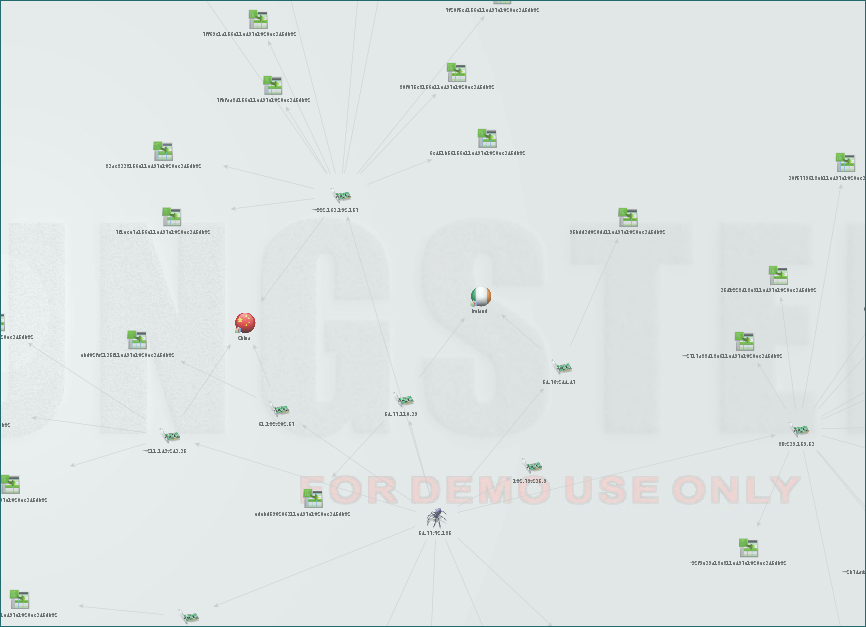

So in my normal fashion, the other week I came up for another Maltego/Canari project while still not having completed most of the other projects I've started. That being said I like to keep things interesting so today I give you [HoneyMalt](https://github.com/catalyst256/HoneyMalt).

The love child of the Canari Framework, Maltego and Kippo (SSH Honeypot), HoneyMalt allows you to pull data out of your Kippo honeypot (as long as you are using MySQL) and display it in a graph. A bit like this one below.

Currently HoneyMalt allows you to display the following information:

"Evil" IP address Geo IP lookup for country code Session ID Username/Password combinations Input (the stuff they type in) File download info

I've also managed to get the hang of Maltego Machines (finally) and all of these transforms run from one machine (who knew that path & paths would give me so much grief). The sneaky use of a Maltego machines and a database means, that if like me you don't have a full version of Maltego (donations accepted) you can still get the all the entities returned instead of hitting the 15 entity limit on a transform run, it just takes a few iterations of the machine running.

There is a quick Youtube video of what that looks like below.

https://www.youtube.com/watch?v=1dBptySUMDQ

I'm also in the process of adding some search functions so you can find specific sessions based on IP address, or keyword or url. After that I will be moving onto more honeypots (Dionaea next) to add into HoneyMalt with the sole intent of trying to breaking your machine while Maltego tries to graph it all (only kidding).

With HoneyMalt I've also resisted the urge to create loads of new entities so where possible I've used the Maltego builtin ones so that you can make use of the existing transform sets which is good for you and means I have less to code (I'm not lazy honest..). Likewise I've also resisted the urge to use lots of Python modules so you only need 3 (currently) and 1 of those is Canari.

The GitHub repo has the install instructions and if you get any problems raise an Issue Ticket on the repo. Repo is [HERE](https://github.com/catalyst256/HoneyMalt)

Have fun!!!
