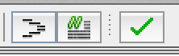

In this episode of Maltego loving (or learning if you prefer that) we are going to talk about **Maltego Machines**. Maltego machines in the simplest form are a collection of transforms that execute in order, each one feeding off the entities generated from the last transform.

Maltego Machines to start with may seem complicated especially when you are trying to get them to run in parallel, but they are incredibly useful and powerful so it seemed worthy to give them their own blog post.

The official documentation for Maltego Machines can be found [HERE](http://www.paterva.com/MSL.pdf).

To start with we are going to create a simple Maltego Machine to run the 'GetRobots-mk2' transform we created in the earlier blog posts. In reality a Machine to run one transform is a bit of a waste but it's a good place to start. To find the Machines within Maltego click.

**Machines - New Machine**

This will launch a wizard that we can use to create our first Machine.

Lets fill in the details;

**Display Name** - The display name for our Machine. **Unique ID** - This is the same principle as with Transforms, make it unique and relevant. **Author** - That will be you. **Description** - Write something in that will make sense if anyone else uses your Machine.

Click Next....

Now we get a choice of the type of Machine we want to create. There are two main types (excluding blank, which we will come back to).

**Macro** - These Machines will execute once (and only once) when you start them. **Timer** - These are my favourite Machines, once started they execute in a timed loop (defined by you) and will keep running until you stop them.

Select **Macro** and click Next...

Now we get to the good part, the next window is the main Machine 'editor', this is where you can add your transforms and make sure the Machine compiles properly. You will also notice that they have pre-loaded the Machine with some example transforms so you have an idea of what it should look like.

There are three options along the top which we will talk about first.

**Format** - This essentially formats your code so it looks pretty. **Toggle Comment** - Will either comment a line or un-comment it (saves you typing 2 //'s). **Compile** - Checks your code and makes sure that it is all happy.

On the right hand side of the window is the list of transforms available for your Machine, you can add local transforms or remote transforms (TDS), but bear in mind if you want to share your Machines you need to make sure that everyone has the transforms you used available (more on exporting stuff from Maltego in the next post).

Right let's get on with the actual coding of the Machine shall we, first off we are going to remove all the stuff that Maltego puts in there by default (that's not actually needed).

`//Welcome to Maltego Machines!`

`//Each machine starts with a statement like this machine("adammax.macgetrobots", displayName:"Get Robots.txt", author:"@catalyst256", description: "A simple 1 transform Maltego machine to uses \ the GetRobots-mk2 transform.") {`

//A macro machine has a start function like this start {

} } //Of course there is much more you can do with machines... Have fun!

Right so we now have a basic (yet empty) Machine so lets add in our transform. In the space between _'start {'_ and the following _'}'_ expand _'Local'_ on the right hand side and then double-click on **GetRobots-mk2**. Your code should now look like this.

`//Welcome to Maltego Machines!`

`//Each machine starts with a statement like this machine("adammax.macgetrobots", displayName:"Get Robots.txt", author:"@catalyst256", description: "A simple 1 transform Maltego machine to uses \ the GetRobots transform.") {`

//A macro machine has a start function like this start { run("adammax.GetRobotsMk2")

} } //Of course there is much more you can do with machines... Have fun!

Notice the lack of formatting?? Click on the **Format** button at the top of the window and magically your code will now look like this.

`//Welcome to Maltego Machines!`

`//Each machine starts with a statement like this machine("adammax.macgetrobots", displayName:"Get Robots.txt", author:"@catalyst256", description: "A simple 1 transform Maltego machine to uses \ the GetRobots transform.") {`

//A macro machine has a start function like this start { run("adammax.GetRobotsMk2")

} } //Of course there is much more you can do with machines... Have fun!

Ok so we've added the transform, we sorted the formatting so now we just need to check to make sure it will compile. Click the green tick at the top of the window and the compile debug screen will appear at the bottom of the window. If we haven't made any horrible mistakes (just copy and paste the code if you have a problem), you should get this wonderful message.

`Compiling machine... Success`

OK so now we have the Machine written (yes thats it), click on **Save**....

We can now run the Machine, create a new graph and add a Website onto it, right-click and under Machines you should see our newly created Machine. But wait what black magic is this? How does the Machine know it can run on that entity type?? So I have no fancy answer for this, other than it takes the first transform in the Machine and based on what entity it is designed to run on will then appear when you right-click on that entity type.

When a Machine is running you get a window in the top right of your Maltego screen that will show the status of the Machine and once it has completed will update and tell you how many entities returned.

Lets now have a look at some of the more "advanced" Machines that are available. We will look at some of the built-in Machines and work through how they work. Click on

**Machines - Manage Machines**

As you can see there are already some pretty cool machines available by default. Lets open one up and see what makes it tick.

Double click on the _'Footprint L1'_ Machine, and the Machine editor will open up.

Now these Machines are read-only so we can't make changes to them, we can however (if so inclined) copy and paste them into a new Machine.

Lets work through the code and see what this Machine does.

`machine("paterva.footprint.level1", displayName:"Footprint L1", author:"Roelof Temmingh", description: "This performs a level 1 (fast, basic) footprint of a domain.") {`

`start { //do all the DNS enumeration log("Performing DNS enumeration",showEntities:false) status("Phase 1 - DNS enumeration") paths { run("paterva.v2.DomainToWebsite_DNS") run("paterva.v2.DomainToDNSName_DNSBrute",slider:500) run("paterva.v2.DomainToDNSName_ZT",slider:10000) run("paterva.v2.DomainToSOAInformation") run("paterva.v2.DomainToWebsiteDNS_SE",slider:255) }`

//here we end up with DNS names (and MX,NS,websites) //take it to IP address and Netblock log("Resolving to IP",showEntities:false) status("Phase 2 - Resolve DNS names") run("paterva.v2.DNSNameToIPAddress\_DNS")

//we now have IP adddresses status("Phase 3 - Netblocks and AS") log("Computing netblocks",showEntities:false) run("paterva.v2.IPAddressToNetblock\_Cuts") log("Looking up AS",showEntities:false) run("paterva.v2.NetblockToAS\_SS")

} }

Right you ready for this..

So the first few lines of this Machine detail the information about the Machine, which is the same as we have in ours.

`machine("paterva.footprint.level1", displayName:"Footprint L1", author:"Roelof Temmingh", description: "This performs a level 1 (fast, basic) footprint of a domain.")`

We then move into the core of the Machine, the first function is a _'log'_. Log is used send a message to the GUI within the Machine window.

`log("Performing DNS enumeration",showEntities:false)`

With this particular _'log'_ function we post the message _"Performing DNS enumeration"_ to the GUI, the _'showEntities:false'_ means that once run it won't log the list of entities to the GUI. If you set this to _'showEntities:true'_ then it will list the entities that the transform will run against.

Next we can see a _'status'_ function.

`status("Phase 1 - DNS enumeration")`

The _'status'_ function within a Maltego Machine sets the contents of the status function ("Phase 1 - DNS enumeration") as the label on the Machine window. This is useful if you are running lots of different stages of transforms and want to be able to track the current running set of transforms.

We can now move onto the main body of this Machine.

`paths { run("paterva.v2.DomainToWebsite_DNS") run("paterva.v2.DomainToDNSName_DNSBrute",slider:500) run("paterva.v2.DomainToDNSName_ZT",slider:10000) run("paterva.v2.DomainToSOAInformation") run("paterva.v2.DomainToWebsiteDNS_SE",slider:255) }` The are two ways you can run transforms in a Machine, you can either run in parallel or in series. The use of _'paths'_ means that these transforms will run in parallel. Basically this means that each of the 5 will run at once against the base entity (so that's 5 transforms run from within 1 Machine). and each transform will return their own entity type into the graph.

The _'slider'_ function within the _'run'_ sets the maximum number of entities that can be returned by the transform. If you are using the community edition of Maltego like me (still looking for donations of a full license) that is 12. The transform below when run will only return 500 entities.

`run("paterva.v2.DomainToDNSName_DNSBrute",slider:500)`

We can now move onto the second block of code.

`//here we end up with DNS names (and MX,NS,websites) //take it to IP address and Netblock log("Resolving to IP",showEntities:false) status("Phase 2 - Resolve DNS names") run("paterva.v2.DNSNameToIPAddress_DNS")`

Again we use _'log'_ and _'status'_ to provide output to the Machine window, we then run another transform which will take the DNS entity returned from the first block of code and run this transform against them.

`run("paterva.v2.DNSNameToIPAddress_DNS")`

The last block of code is below.

`//we now have IP adddresses status("Phase 3 - Netblocks and AS") log("Computing netblocks",showEntities:false) run("paterva.v2.IPAddressToNetblock_Cuts") log("Looking up AS",showEntities:false) run("paterva.v2.NetblockToAS_SS")`

This takes the IP addresses from the last transform and then runs two more transforms (with _'log'_ and _'status'_ messages) in sequence.

So now we know some more functions of Machines, lets update ours to do a little bit more. We are going to add some _'log'_ and _'status'_ messages. Have a look at the code below (which you can copy and paste over the original Machine we did).

`//Welcome to Maltego Machines!`

`//Each machine starts with a statement like this machine("adammax.macgetrobots", displayName:"Get Robots.txt", author:"@catalyst256", description: "A simple 1 transform Maltego machine to uses \ the GetRobots transform.") {`

//A macro machine has a start function like this start { log("Hunting for Robots.txt",showEntities:true) status("Connecting to Website") run("adammax.GetRobotsMk2")

} } //Of course there is much more you can do with machines... Have fun!

Below is a screenshot of what the Machine window now shows.

There is a lot more to Maltego Machines that I haven't covered but hopefully you will have a good idea of what they can do and how to go about coding them. Have a look at the other built-in Machines and the documentation I've linked at the top of the post is very good.

Enjoy
