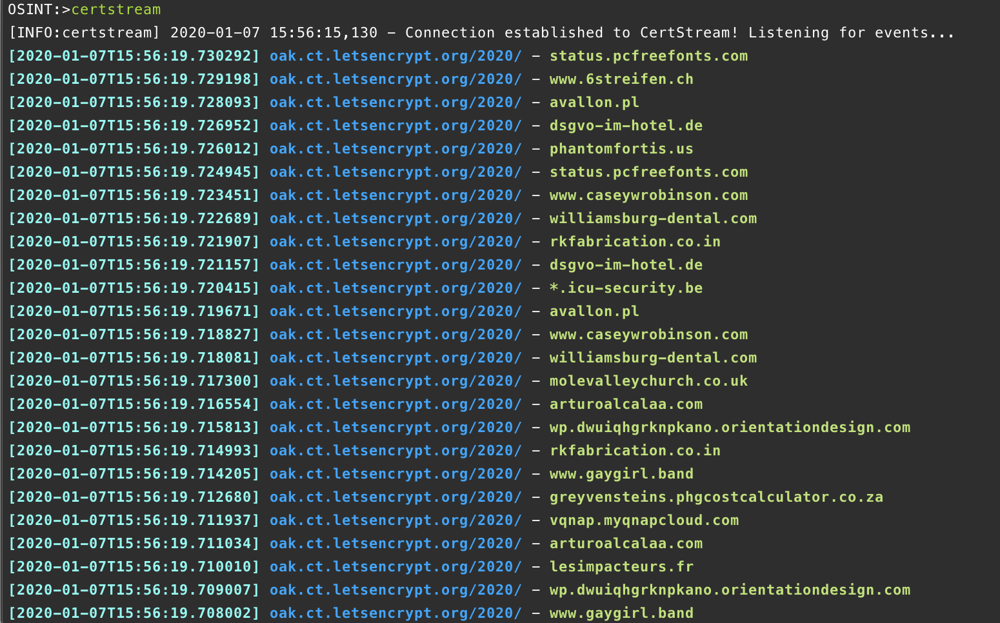
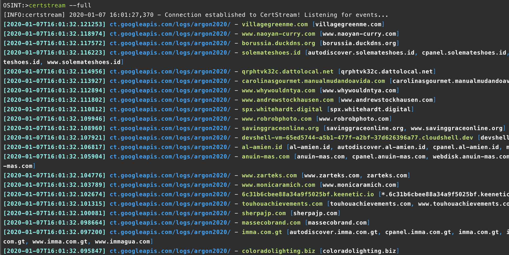
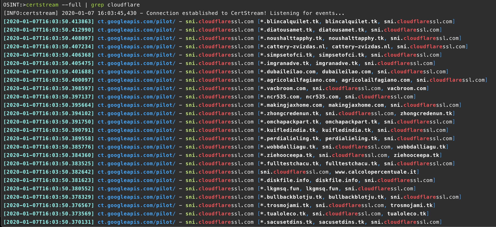
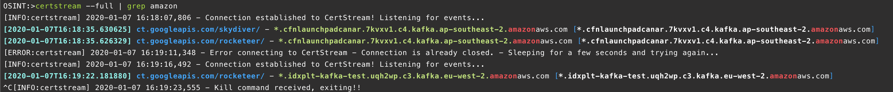
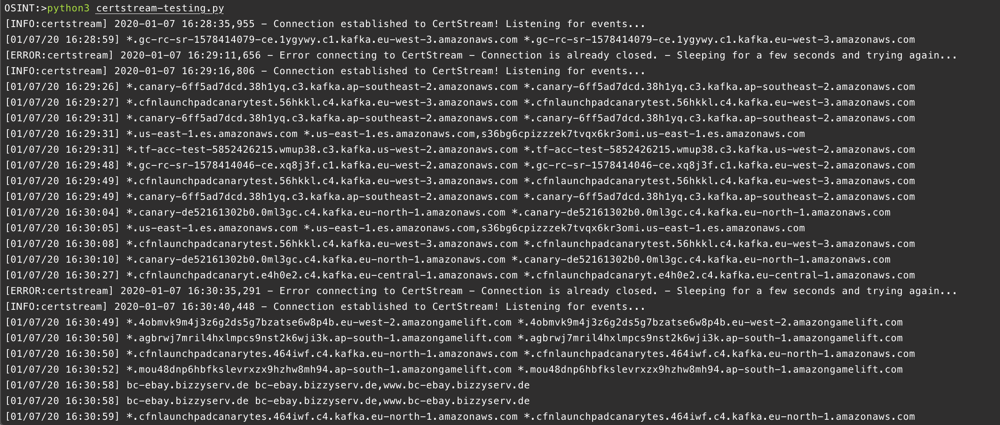

NOTE: The wonderful people over at OSINT Curious wrote a similar blog post about this last year. The link is [HERE](https://osintcurio.us/2019/03/12/certificates-the-osint-gift-that-keeps-on-giving/). I recommend giving it a read if you want to know more about how to “hunt” using information from certificates.

It’s 2020 and I made myself a promise to try and write more blog posts about things so here is the first for the year. SSL/TLS certificates have been a great resource for a while now to identify, pivot from and hunt for infrastructure on the internet. The introduction of the Certificate Transparency Lists were first introduced by Google in 2013 after DigiNotar was compromised in 2011. It basically provides public logs of certificates issued by trusted certificate authorities and is a great source of intel for a number of functions (such as, but not limited to):

- Detection of phishing websites
- Brand/Reputation Monitoring
- Tracking malicious infrastructure
- Bug Bounties

For a long time newly registered/observed domains have been an indicator or potential malicious activity, for example if ebaythisisfake.com was registered you could guess that this was going to be a phishing website. The issue with watching for newly registered domains (it’s still a good indicator), is that a domain could be purchased and then not used for days/months/years.

The wonderful thing about using the CT lists is that the fact a certificate has been registered usually (probably 95% of the time) means that the infrastructure is active and in use, it also means that there is active DNS (required for requesting a certificate) for that domain and an IP address to investigate. It also allows you to catch when a legitimate domain has been compromised and is being used for malicious stuff, for example ebay.legitimatedomain.com which is why CT lists are great for catching phishing websites.

Since the initial launch of number of companies have started collecting the information published on the CT lists (why not it’s free), and either providing it as part of an existing service (Cyber Threat Intel), providing tools to look up specific domains (Facebook for example) or giving people access to the raw data in an easy to consume way (this is the one we are interested in).

It’s worth noting that while the CT lists are publicly available, the sheer volume of data generated by them means it’s much easier to use a feed from someone else than build your own, unless of course you want to..

For the rest of this post we are going to be focusing on one specific provider, which is from Calidog ([https://certstream.calidog.io/](https://certstream.calidog.io/)), this company provide the data for free, and have a number of libraries for different programming languages and a command line tool as well.

The command line tool is python based so you can simply install it using Python’s PIP library (we use pip3 because Python 2.7 is end of life).

```
pip3 install certstream
```

Once it’s been installed you can then run “certstream” from the command line, running it without any options will just connect and start pulling down the firehose of certificate information.

_certstream just being run from the command line_

Straight away you can start to see the certificates information flying across your terminal. The default option just shows a timestamp, certificate authority and the certificate common name that is being registered. OK its interesting but not very helpful (for our needs anyway). If you run “certstream — full” you will get the same information as well as “all domains” which are any other domain names assigned to that certificate.

_certstream with the — full switch_

This “all domains” information is really useful if you are for example tracking a domain or keyword that uses Cloudflare or similar platforms that provide SSL certificates. If you were to run `certstream — full | grep cloudflare` you would see all the new certificates for services behind Cloudflare.

_certstream with — full and grepping for cloudflare_

Let’s have a look at some use cases, how about if you were interesting in bug bounties you can use CT lists to discover new infrastructure being created by your target company. If you were to run `certstream — full | grep tesla.com` for example you see any new certificates being created that contained the word “tesla.com”. You could even remove the “.com” part and search for the word tesla, this would generate more false positives but would show third party services that Tesla might be using (for example tesla.glassdoor.com). Another use case similar to this if you were to run `certstream — full | grep amazon` (for example) it would show any new certificates (as well as some false positives) that are generated by Amazon.

_certstream with — full and grepping for amazon_

What about brand reputation monitoring, this is where someone is registering a certificate that will be part of a phishing website. This is important if you have customers that have to log into your website, or have to enter some kind of credentials. You can easily do this at the command line using similar commands to before, such as `certstream — full | grep [keyword]`.

The problem with using the command line in this way is that it’s great for short time monitoring but if you want to include this as part of an overall monitoring solution or longer term research you will need to code up a solution. The good thing is that there are libraries available on the calidog.io website and they provide code examples and data pulled from the CT lists (via calidog.io) is JSON formatted so easy to use (well sometimes at least).

For this example we are going to use the Python library and extend the code example to allow the use of multiple keywords. The output will write to the command line but can easily be changed to send either the full JSON or the parts you want to another platform (NoSQL, Elastic, Splunk, Slack etc. etc.).

This is the code currently, it takes a list of keywords and then looks for those in each newly registered certificate, if there is a match it will print it out to the command line. The code uses “paypal”, “ebay” & “amazon” as our example keywords but you can could change this to anything you want.

\[code lang=python\] import logging import sys import datetime import certstream

keyword = \['paypal', 'amazon', 'ebay'\]

def print\_callback(message, context): logging.debug("Message -> {}".format(message))

if message\['message\_type'\] == "heartbeat": return

if message\['message\_type'\] == "certificate\_update": domains = message\['data'\]\['leaf\_cert'\]\['all\_domains'\] if \[k for k in keyword if k in ' '.join(domains)\]: sys.stdout.write(u"\[{}\] {} {} \\n".format(datetime.datetime.now().strftime('%m/%d/%y %H:%M:%S'), domains\[0\], ','.join(domains))) sys.stdout.flush()

logging.basicConfig(format='\[%(levelname)s:%(name)s\] %(asctime)s - %(message)s', level=logging.INFO)

certstream.listen\_for\_events(print\_callback, url='wss://certstream.calidog.io/') \[/code\]

Now the code won’t necessarily output something straight away as it’s looking just for the keywords you’ve specified but in the screenshot below you can see the output from about 5 minutes using the example keywords.

_Example output of the above python script after 5 minutes_

If you want to use the data retrieved from the CT list to pivot into other data sources, you can expand the number of fields returned (or use the whole thing) to get the certificate serial number, fingerprint etc.

All the available fields are shown in the Github repository for the calidog.io Python library which is available at the link below: [https://github.com/CaliDog/certstream-python](https://github.com/CaliDog/certstream-python)

**Python Code:**

I’ve made the code used in this post a bit more robust and pushed it to my “Junk” Github repo which you can find [HERE](https://github.com/catalyst256/MyJunk/blob/master/osint-certstream.py).

To run the code you first need to make sure you are using Python3, and have installed the “certstream” library. To install the certstream python library you just need to type on a terminal/command line.

```
pip3 install certstream
```

Once the certstream python library is installed you need to create a text file with your list of “keywords”. A single keyword per line is perfect so for example if you wanted to look for new certificate requests for _Amazon_, _EBay_ and _PayPal_ (for example) just create a file (doesn’t matter what the filename is) and add;

\[code lang=text\] amazon ebay paypal \[/code\]

To run the code just execute the following;

```
python3 osint-certstream.py [filename]
```

So if your keywords filename is keywords.txt for example you would just run;

```
python3 osint-certstream.py keywords.txt
```

To stop the code at any time you can just CTRL + C to kill it.

Let me know if you have any issues, the code works it’s just production ready but gives you an idea of what is possible.
