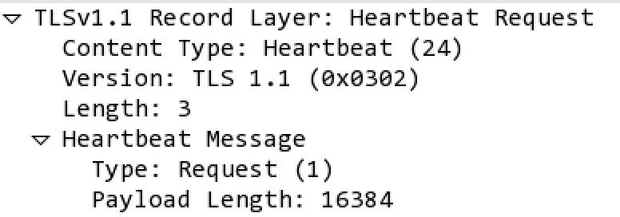

So I might be a bit late to the game but I post this code on Twitter a while back but then forgot to blog about so here you go...

I've written a little snippet of Python code that uses Scapy to search through a pcap file looking for Heartbleed requests and responses. Due to Scapy not having a layer for TLS connections this have been done by slicing and dicing the RAW layer and pulling out the information we need. A lot of the time that I'm writing Scapy code to analyse pcap files I use Wireshark to look at the packets and match that up in Scapy.

This is the output from Wireshark;

And this is what Scapy sees;

`Raw load='\x18\x03\x02\x00\x03\x01@\x00'`

Currently the script just looks for traffic on port 443, but I will tweak it over the next week or two to handle any port.

I've removed the port restrictions so it should be protocol agnostic.. (hopefully)..

You can find the code [HERE](https://github.com/catalyst256/MyJunk/blob/master/pcap-heartbleed.py):

To run it, just type

`./pcap-heartbleed.py [pcapfile]`

So for example:

`./pcap-heartbleed.py heartbleed.pcap`

If it finds anything it thinks is a Heartbleed packet you get an output similar to the one below (I've changed the IP addresses):

`Heartbleed Request: src: 1.1.1.1 dst: 2.2.2.2 Heartbleed Response: src: 2.2.2.2 dst: 1.1.1.1 Heartbleed Request: src: 1.1.1.1 dst: 2.2.2.2 Heartbleed Response: src: 2.2.2.2 dst: 1.1.1.1 Heartbleed Request: src: 1.1.1.1 dst: 2.2.2.2 Heartbleed Response: src: 2.2.2.2 dst: 1.1.1.1`

Enjoy!!
