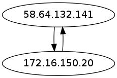

So the 3rd blog post of the day is a cool function in Scapy called _**conversations**_. Essentially this takes a pcap file and outputs an image of all the conversations between IP addresses. To run this in Scapy you would do something like this:

`>>> pkts=rdpcap('test.pcap')  `

> `>> pkts.conversations()`

What you should get is an image pop up on your screen with all the IP conversations in it, now that's some cool shit.

Now why would you write a script for something that simple?? Well if you want to output the file (i.e. save it) there seems to be a bug with Scapy that it errors (well does for me). If you try this..

`>>> pkts.conversations(type='jpg',target='/tmp/1.jpg')`

You get this:

`>>> Error: dot: can't open /tmp/1.jpg`

I did some research and it seems that command **dot** which is used to create the image, when you output it to a file has a slightly different syntax in the version on Kali.

So rather than raising a bug issue with Scapy I ported the code into my own python script (I was in a rush to use it in sniffmypackets).

The **pcap-convo.py** file can be found in my GitHub repo [HERE](https://github.com/catalyst256/MyJunk):

To use the script use the following syntax:

`./pcap-convo.py pcapfile outputfile`

In real life that would be something like this:

`./pcap-convo /root/pcap/test.pcap /tmp/out.jpg`

Once it's run you should see something like this:

Check your output file and you should have something that looks like this:

So there you go, another cool Python/Scapy lovechild.

Enjoy
